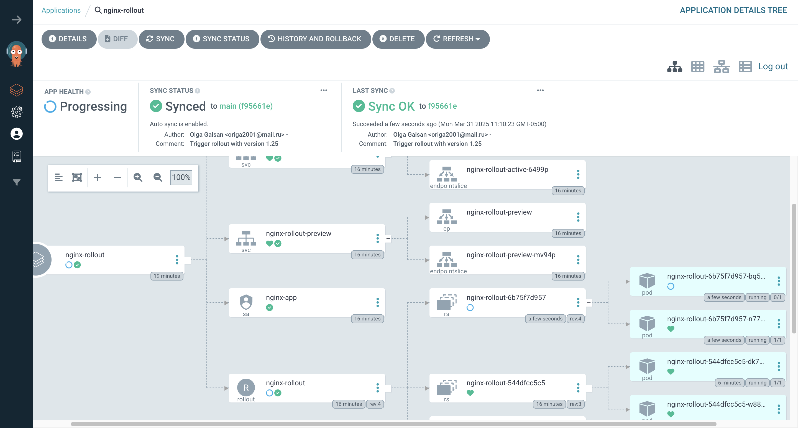

# DevOps Take-Home Assignment – EKS + GitOps


## Overview

This project demonstrates a GitOps-based deployment pipeline on AWS EKS using Terraform, ArgoCD, Helm and Kubernetes. It provisions cloud infrastructure, sets up GitOps automation and deploys a sample microservice to an EKS cluster.

---

## 🛠 Tech Stack

- **AWS EKS** – Kubernetes Cluster
- **Terraform** – Infrastructure as Code (IaC)
- **Helm** – Kubernetes Package Manager
- **ArgoCD** – GitOps Continuous Delivery
- **Kubernetes** – Container Orchestration
- **GitHub** – Source Code Management

---

## 📁 Project Structure

```
US-Mobile-project/
├── infra/                      # Terraform code for VPC, EKS, IAM etc.
│   ├── main.tf
│   ├── variables.tf
│   ├── outputs.tf
│   └── ...
│
├── gitops-repo/                # GitOps repo ArgoCD points to
│   ├── applications/           # ArgoCD Application manifests
│   │   ├── sample-app.yaml
│   │   ├── nginx-app.yaml
│   │   └── nginx-rollout.yaml
│   ├── nginx-app/              # Helm chart for nginx-app
│   │   ├── Chart.yaml
│   │   ├── values.yaml
│   │   └── templates/
│   │       ├── deployment.yaml
│   │       ├── service.yaml
│   │       ├── serviceaccount.yaml
│   │       └── ...
│   └── nginx-rollout/          # Helm chart for nginx-rollout (Argo Rollouts)
│       ├── Chart.yaml
│       ├── values.yaml
│       └── templates/
│           ├── deployment.yaml
│           ├── service.yaml
│           ├── serviceaccount.yaml
│           └── ...
│
├── assets/                     # Screenshots for README
│   ├── backoff.png
│   └── argo-rollout-progress.png
│
├── .gitignore
└── README.md

```
---

## 🚀 Pipeline Overview

### 1. **Infrastructure Provisioning (Terraform)**

- Provisions:
  - VPC, Subnets
  - IAM roles and policies
  - EKS Cluster and worker nodes
- Outputs EKS cluster info for `kubectl` access.

### 2. **GitOps Setup (ArgoCD)**

- ArgoCD installed via Helm.
- Monitors the GitHub repo (`gitops-repo/applications/`) for changes.
- Automatically syncs application state into the EKS cluster.

### 3. **Application Deployment (Helm + ArgoCD)**

- `nginx-app` is packaged as a Helm chart.
- Chart includes:
  - Kubernetes `Deployment`, `Service`, `ServiceAccount`
  - Readiness and Liveness Probes for health checks
- ArgoCD syncs and deploys the chart to EKS on every Git push.

---

## 🔁 Rollback Logic

- The `nginx-app` Helm chart includes probes (`readinessProbe`, `livenessProbe`) to monitor application health.
- To simulate failure, the container image tag was set to a fake value (`nginx:itdoesnotexist123`).
- This caused Kubernetes to enter `ImagePullBackOff` and ArgoCD marked the app as **Processing**.
- Once the correct image tag was restored ArgoCD automatically resynced and restored the working app.

---

## 🧪 Testing Failure (Rollback Scenario)

To test:

1. In `values.yaml`, set:
   ```yaml
   image:
     repository: nginx
     tag: itdoesnotexist123
     pullPolicy: Always

2. Commit and push the change.
3. ArgoCD will:

- Attempt to sync the application
- Detect the failed rollout (`ImagePullBackOff`)
- Mark the app as **Degraded**

4. Fix the tag → commit → sync returns app to healthy state.

✅ This confirms GitOps-based reactive deployment and health monitoring are functioning.

---

## 📸 Screenshot: Failed Deployment

This screenshot shows the `ImagePullBackOff` error triggered by a bad image tag (`nginx:itdoesnotexist123`):


---

## 🎥 Blue/Green Rollout – Visual Demo

This project implements a Blue/Green deployment strategy using Argo Rollouts.

When a new image tag is committed to GitHub:

- A new version is launched in **preview**
- The current version stays in **active**
- Once health checks pass, traffic is promoted to the new version

✅ Below is a screenshot showing the rollout **in progress** (v1.25 being deployed):



---

## 🔒 Security

- Sensitive values like `tfvars` and `.terraform` folders are excluded via `.gitignore`.
- No secrets are hardcoded.

---

## 👤 Author

**Olga Galsan**  
🔗 [GitHub Repository](https://github.com/Olga-Galsan/US-Mobile-project)

---

## 🚀 How to Run (Optional for Reviewers)

```bash
cd infra/
terraform init
terraform apply

```

Then connect to EKS and install ArgoCD:

aws eks --region <region> update-kubeconfig --name <cluster-name>
helm repo add argo https://argoproj.github.io/argo-helm
helm repo update
kubectl create namespace argocd
helm install argocd argo/argo-cd -n argocd

Port-forward and login to ArgoCD:

kubectl port-forward svc/argocd-server -n argocd 8080:443

After reaching the UI the first time you can login with username: admin and the random password generated during the installation. You can find the password by running:

kubectl -n argocd get secret argocd-initial-admin-secret -o jsonpath="{.data.password}" | base64 -d