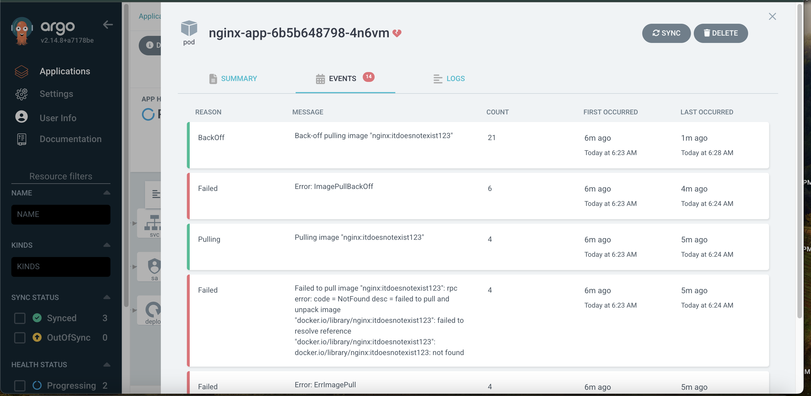

# DevOps Take-Home Assignment – EKS + GitOps


## Overview

This project demonstrates a GitOps-based deployment pipeline on AWS EKS using Terraform, ArgoCD, Helm and Kubernetes. It provisions cloud infrastructure, sets up GitOps automation and deploys a sample microservice to an EKS cluster.

---

## 🛠 Tech Stack

- **AWS EKS** – Kubernetes Cluster
- **Terraform** – Infrastructure as Code (IaC)
- **Helm** – Kubernetes Package Manager
- **ArgoCD** – GitOps Continuous Delivery
- **Kubernetes** – Container Orchestration
- **GitHub** – Source Code Management

---

## 📁 Project Structure
```
US-Mobile-project/
├── infra/                  # Terraform code for VPC, EKS, IAM, etc.
│   ├── main.tf
│   ├── variables.tf
│   ├── outputs.tf
│   └── ...
│
├── gitops-repo/            # GitOps repo ArgoCD points to
│   ├── applications/       # ArgoCD Application manifests
│   │   ├── sample-app.yaml
│   │   └── nginx-app.yaml
│   └── nginx-app/          # Helm chart for the nginx-app
│       ├── Chart.yaml
│       ├── values.yaml
│       ├── templates/
│       │   ├── deployment.yaml
│       │   ├── service.yaml
│       │   ├── serviceaccount.yaml
│       │   └── ...
│
├── .gitignore
└── README.md
```

---

## 🚀 Pipeline Overview

### 1. **Infrastructure Provisioning (Terraform)**

- Provisions:
  - VPC, Subnets
  - IAM roles and policies
  - EKS Cluster and worker nodes
- Outputs EKS cluster info for `kubectl` access.

### 2. **GitOps Setup (ArgoCD)**

- ArgoCD installed via Helm.
- Monitors the GitHub repo (`gitops-repo/applications/`) for changes.
- Automatically syncs application state into the EKS cluster.

### 3. **Application Deployment (Helm + ArgoCD)**

- `nginx-app` is packaged as a Helm chart.
- Chart includes:
  - Kubernetes `Deployment`, `Service`, `ServiceAccount`
  - Readiness and Liveness Probes for health checks
- ArgoCD syncs and deploys the chart to EKS on every Git push.

---

## 🔁 Rollback Logic

- The `nginx-app` Helm chart includes probes (`readinessProbe`, `livenessProbe`) to monitor application health.
- To simulate failure, the container image tag was set to a fake value (`nginx:itdoesnotexist123`).
- This caused Kubernetes to enter `ImagePullBackOff` and ArgoCD marked the app as **Processing**.
- Once the correct image tag was restored ArgoCD automatically resynced and restored the working app.

---

## 🧪 Testing Failure (Rollback Scenario)

To test:

1. In `values.yaml`, set:
   ```yaml
   image:
     repository: nginx
     tag: itdoesnotexist123
     pullPolicy: Always

2. Commit and push the change.
3. ArgoCD will:

Attempt to sync

Detect failed rollout

Mark app as Processing

4. Fix the tag → commit → sync returns app to healthy state.

✅ This confirms GitOps-based reactive deployment and health monitoring are functioning.

## 📸 Screenshot: Failed Deployment

Below is a screenshot showing the failed deployment status (`ImagePullBackOff`) caused by a broken image tag:




---

## ✨ Extra Credit

> Implemented: ✅ ArgoCD + Helm  
> Optional: Argo Rollouts (blue/green) – *not implemented yet*

---

## 🔒 Security

- Sensitive values like `tfvars` and `.terraform` folders are excluded via `.gitignore`.
- No secrets are hardcoded.

---

## Author

Olga Galsan – https://github.com/Olga-Galsan/US-Mobile-project
